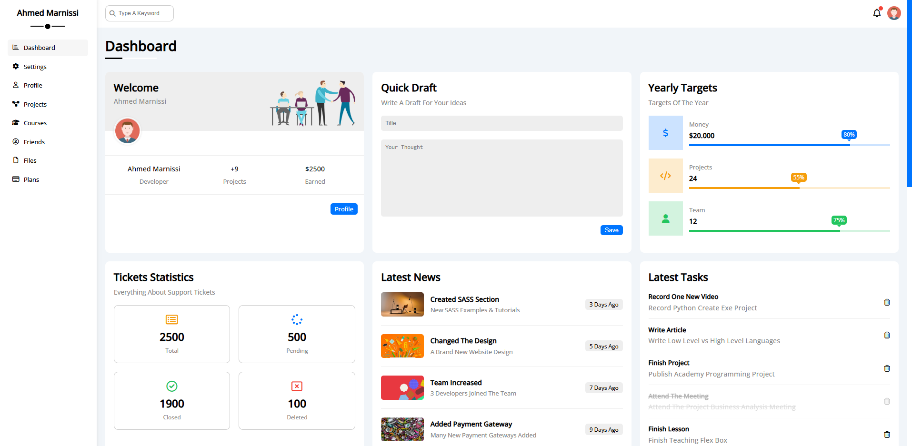
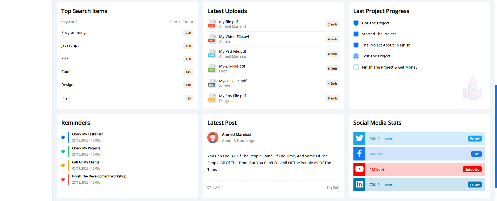
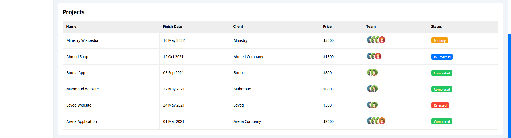
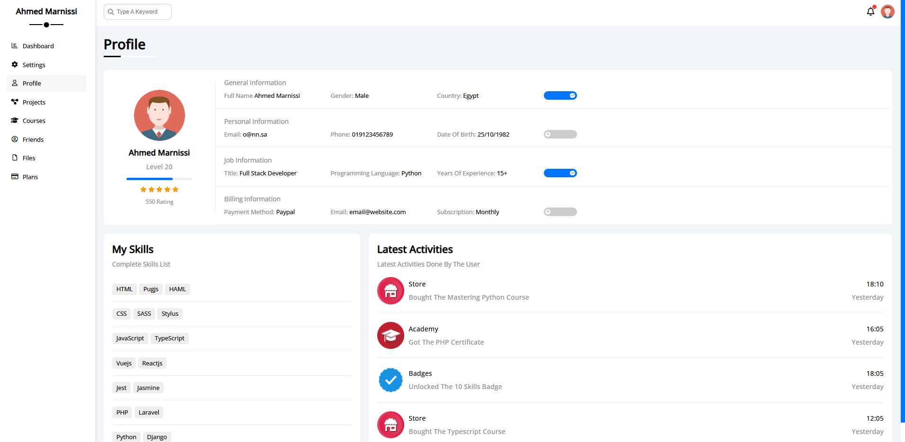
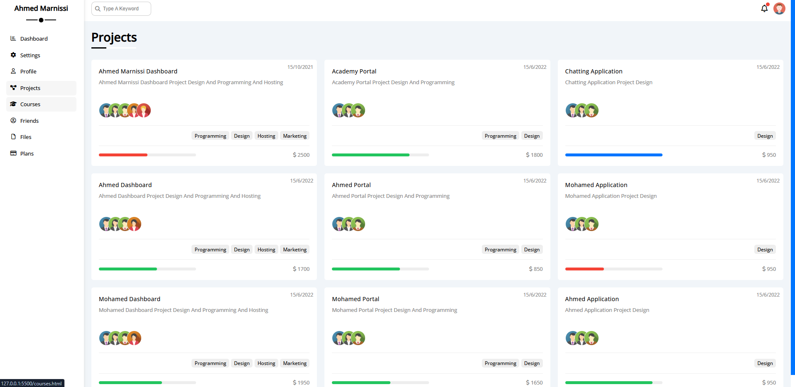
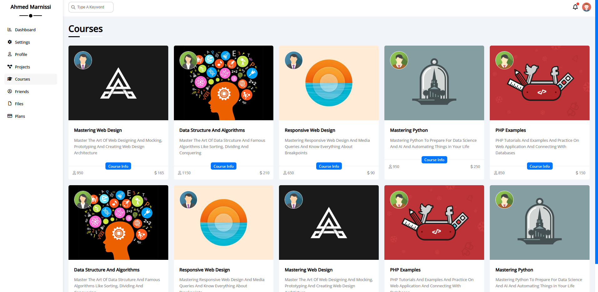
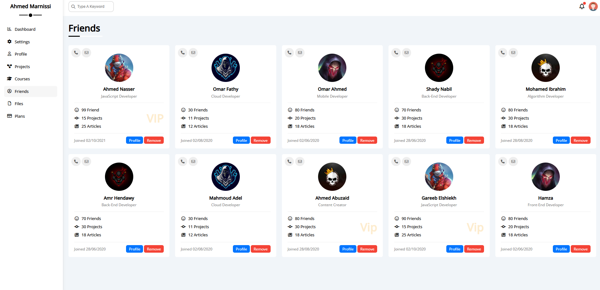
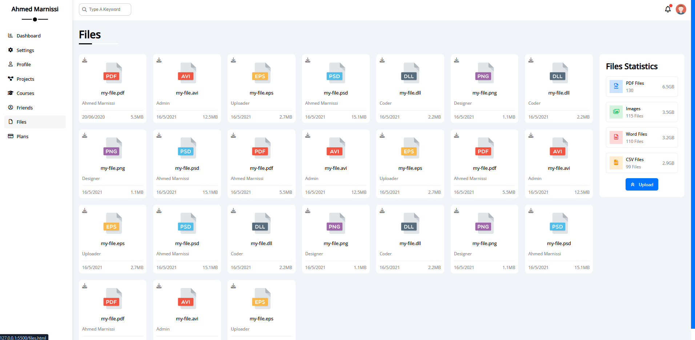
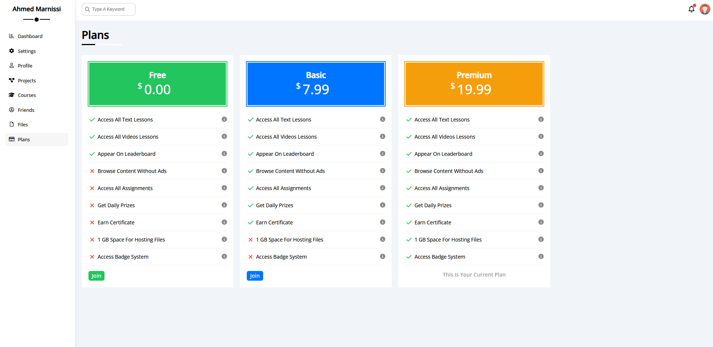
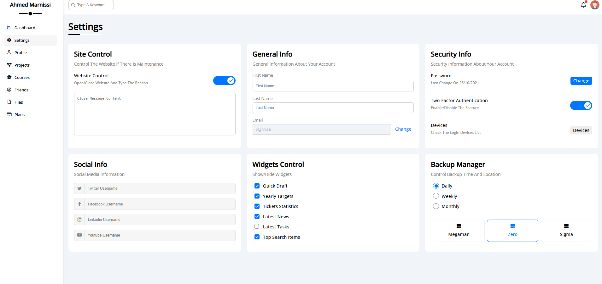

<div align="center">

# 📊 Ahmed's Dashboard Management System


A fully featured **admin dashboard management system** built with pure **HTML5**, **CSS3**, and **JavaScript** — no frameworks, no dependencies, just clean professional frontend code.

**👨‍💻 Author:** Marnissi Ahmed Mustapha &nbsp;|&nbsp; **📅 Last Updated:** May 2026

[](https://github.com/AhmedMustaphaMarnissi)

</div>

---

## ⚡ TL;DR

A complete multi-page **admin dashboard** with 8 fully designed pages — Dashboard, Profile, Projects, Courses, Friends, Files, Plans, and Settings. Every page is built with semantic HTML, structured CSS, and real UI components including progress bars, stats widgets, data tables, pricing cards, file managers, and social stats.

👉 Not a template clone — a **hand-crafted, fully custom** admin interface with real content, real data, and a polished multi-section layout.

---

## 💡 Key Highlights

- 8 complete, fully designed pages accessible from a persistent sidebar
- Real data widgets: ticket stats, yearly targets, social media counters, project progress tracker
- Quick Draft editor, Reminders, Latest News, and Latest Tasks panels on the dashboard
- Full user Profile with skills list, activity feed, and billing info
- Projects gallery with team avatars, progress bars, tags, and pricing
- Courses catalog with thumbnails, enrollment counts, and pricing
- Friends directory with VIP badges, developer roles, and contact actions
- File manager with type icons, owner info, file size, and sidebar statistics
- Three-tier pricing page (Free / Basic / Premium) with full feature comparison
- Six-panel Settings page with Site Control, Security, Widgets toggle, and Backup Manager

---

## 📋 Table of Contents

- [Overview](#overview)
- [Pages & Screenshots](#pages--screenshots)
  - [Dashboard — Part 1](#-dashboard--part-1)
  - [Dashboard — Part 2](#-dashboard--part-2)
  - [Dashboard — Part 3 (Projects Table)](#-dashboard--part-3-projects-table)
  - [Profile](#-profile)
  - [Projects](#-projects)
  - [Courses](#-courses)
  - [Friends](#-friends)
  - [Files](#-files)
  - [Plans](#-plans)
  - [Settings](#-settings)
- [Dashboard Widgets In Detail](#-dashboard-widgets-in-detail)
- [Tech Stack](#tech-stack)
- [Getting Started](#getting-started)
- [What I Learned](#-what-i-learned)

---

## Overview

**Dashboard Management System** is a fully custom admin panel template built from scratch with HTML5, CSS3, and JavaScript. The project simulates a real-world management platform — a developer personal space where you can track projects, manage courses, communicate with team members, handle files, and control settings.

The layout features a persistent left sidebar with navigation links, a top bar with global search and notification bell, and a rich content area that changes per page. Every section is self-contained, fully styled, and packed with real UI components — no placeholder lorem ipsum, no blank cards.

---

## Pages & Screenshots

### 🏠 Dashboard — Part 1

The main landing page after login. Three columns across the top row: a **Welcome card** with user stats (9 Projects, $2500 Earned), a **Quick Draft** editor for saving ideas with a title and body, and a **Yearly Targets** tracker showing Money ($20,000 at 80%), Projects (24 at 55%), and Team (12 at 75%) as labeled progress bars.

The bottom row features **Tickets Statistics** (2500 Total / 500 Pending / 1900 Closed / 100 Deleted), a **Latest News** feed with thumbnails and timestamps, and a **Latest Tasks** list with deletable task items.



---

### 📋 Dashboard — Part 2

A continuation of the dashboard scrolling further down. **Top Search Items** widget displays the most searched keywords with search counts (Programming 220, JavaScript 180, PHP 160, Code 145, Design 110, Logic 95). **Latest Uploads** shows recent file uploads with type badges (PDF, AVI, PSD, ZIP, DLL, EPS), uploader name, and file size.

**Last Project Progress** shows a step-by-step project tracker: Got The Project → Started The Project → The Project About To Finish → Test The Project → Finish The Project & Get Money.

**Reminders** shows color-coded dated reminders. **Latest Post** shows a user-authored post with likes and comment count. **Social Media Stats** displays follower/like counts for Twitter (90K), Facebook (2M), YouTube (1M Subs), and LinkedIn (70K) with action buttons.



---

### 📊 Dashboard — Part 3 (Projects Table)

The bottom section of the dashboard features a full **Projects summary table** listing active and past projects with columns: Name, Finish Date, Client, Price, Team (avatar group), and Status badge. Status badges include color-coded states — Pending (orange), In Progress (blue), Completed (green), and Rejected (red).

| Project | Client | Price | Status |
|---|---|---|---|
| Ministry Wikipedia | Ministry | $5,300 | Pending |
| Ahmed Shop | Ahmed Company | $1,500 | In Progress |
| Bouba App | Bouba | $800 | Completed |
| Mahmoud Website | Mahmoud | $600 | Completed |
| Sayed Website | Sayed | $300 | Rejected |
| Arena Application | Arena Company | $2,600 | Completed |



---

### 👤 Profile

The Profile page displays four structured information blocks: **General Information** (Full Name, Gender, Country with toggle), **Personal Information** (Email, Phone, Date of Birth with toggle), **Job Information** (Title: Full Stack Developer, Programming Language: Python, Years of Experience: 15+ with toggle), and **Billing Information** (Payment Method: Paypal, Subscription: Monthly with toggle).

Below that, **My Skills** shows a categorized skill tag list: HTML / Pug.js / HAML → CSS / SASS / Stylus → JavaScript / TypeScript → Vue.js / React.js → Jest / Jasmine → PHP / Laravel → Python / Django and more.

The **Latest Activities** panel on the right logs recent user actions with icons and timestamps: bought the Mastering Python Course, earned the PHP Certificate, unlocked the 10 Skills Badge, and purchased the TypeScript Course.



---

### 🗂️ Projects

A grid-based projects gallery showing all active and completed projects as cards. Each card displays the project name, description, a team member avatar group, skill tags (Programming / Design / Hosting / Marketing), a colored progress bar, and the project price.

**Projects showcased:**
- Ahmed Marnissi Dashboard — $2,500 (Programming, Design, Hosting, Marketing)
- Academy Portal — $1,800 (Programming, Design)
- Chatting Application — $950 (Design)
- Ahmed Dashboard — $1,700 (Programming, Design, Hosting, Marketing)
- Ahmed Portal — $850 (Programming, Design)
- Mohamed Application — $950 (Design)
- Mohamed Dashboard — $1,950 (Programming, Design, Hosting, Marketing)
- Mohamed Portal — $1,650 (Programming, Design)
- Ahmed Application — $950 (Design)



---

### 🎓 Courses

A courses catalog page displaying available courses as thumbnail cards. Each card includes an instructor avatar, course cover image, course name, a short description, an enrollment count, a price, and a **Course Info** button.

**Courses in the catalog:**
- **Mastering Web Design** — Web design mocking, prototyping, and architecture. 950 enrolled / $165
- **Data Structure And Algorithms** — Sorting, dividing, and conquering algorithms. 1150 enrolled / $210
- **Responsive Web Design** — Media queries and breakpoints mastery. 650 enrolled / $90
- **Mastering Python** — Python for Data Science and AI automation. 950 enrolled / $250
- **PHP Examples** — PHP tutorials with database connectivity. 850 enrolled / $150



---

### 👥 Friends

A friends directory showing each contact as a card with their avatar, name, developer role, friend count, project count, article count, join date, and two action buttons: **Profile** and **Remove**. VIP badges are shown on select members.

**Friends listed:**
- Ahmed Nasser — JavaScript Developer (99 Friends, 15 Projects, 25 Articles) — VIP
- Omar Fathy — Cloud Developer (30 Friends, 11 Projects, 12 Articles)
- Omar Ahmed — Mobile Developer (80 Friends, 20 Projects, 18 Articles)
- Shady Nabil — Back-End Developer (70 Friends, 30 Projects, 18 Articles)
- Mohamed Ibrahim — Algorithm Developer (80 Friends, 30 Projects, 18 Articles)
- Amr Hendawy — Back-End Developer (70 Friends, 30 Projects, 18 Articles)
- Mahmoud Adel — Cloud Developer (30 Friends, 11 Projects, 12 Articles)
- Ahmed Abuzaid — Content Creator (80 Friends, 30 Projects, 18 Articles) — VIP
- Gareeb Elshiekh — JavaScript Developer (90 Friends, 15 Projects, 25 Articles) — VIP
- Hamza — Front-End Developer (80 Friends, 20 Projects, 18 Articles)



---

### 📁 Files

A full **file manager** page displaying uploaded files as icon cards. Each card shows the file type icon (color-coded: PDF red, AVI orange, EPS yellow, PSD blue, DLL dark, PNG green), the file name, uploader name, upload date, and file size.

The **Files Statistics** sidebar on the right summarizes storage usage by type:
- PDF Files — 130 files / 6.5 GB
- Images — 115 files / 3.5 GB
- Word Files — 110 files / 3.2 GB
- CSV Files — 99 files / 2.9 GB

An **Upload** button is available to add new files directly from this panel.



---

### 💳 Plans

A three-tier **subscription pricing page** with clear feature comparison across all plans:

| Feature | Free ($0.00) | Basic ($7.99) | Premium ($19.99) |
|---|---|---|---|
| Access All Text Lessons | ✅ | ✅ | ✅ |
| Access All Video Lessons | ✅ | ✅ | ✅ |
| Appear On Leaderboard | ✅ | ✅ | ✅ |
| Browse Without Ads | ❌ | ✅ | ✅ |
| Access All Assignments | ❌ | ✅ | ✅ |
| Get Daily Prizes | ❌ | ✅ | ✅ |
| Earn Certificate | ❌ | ✅ | ✅ |
| 1 GB Space For Hosting Files | ❌ | ❌ | ✅ |
| Access Badge System | ❌ | ❌ | ✅ |

Premium is marked as the current active plan with "This Is Your Current Plan" instead of a Join button.



---

### ⚙️ Settings

A six-panel settings page covering every aspect of account and site configuration:

- **Site Control** — Open/Close the website and set a maintenance message via toggle
- **General Info** — Edit First Name, Last Name, and Email with a Change button
- **Security Info** — Change password (last changed 25/10/2021), enable/disable Two-Factor Authentication, and manage login Devices
- **Social Info** — Set social media usernames for Twitter, Facebook, LinkedIn, and YouTube
- **Widgets Control** — Toggle individual dashboard widgets on/off: Quick Draft, Yearly Targets, Tickets Statistics, Latest News, Latest Tasks, Top Search Items
- **Backup Manager** — Set backup frequency (Daily / Weekly / Monthly) and choose a backup style (Megaman / Zero / Sigma)



---

## 🧩 Dashboard Widgets In Detail

The dashboard home page is composed of **12 distinct widget components**, each independently styled and data-filled:

| Widget | Description |
|---|---|
| Welcome Card | User greeting with avatar, role, project count, and earnings |
| Quick Draft | In-page editor with title and body fields + Save button |
| Yearly Targets | Three labeled progress bars for Money, Projects, and Team |
| Tickets Statistics | 4-stat grid: Total / Pending / Closed / Deleted |
| Latest News | Thumbnail feed with headlines and relative timestamps |
| Latest Tasks | Deletable task list with completion strike-through |
| Top Search Items | Keyword ranking table with search count badges |
| Latest Uploads | File list with type badges, uploader, and file size |
| Last Project Progress | Step-by-step project completion tracker |
| Reminders | Color-dot dated reminder list |
| Latest Post | User blog post card with like and comment count |
| Social Media Stats | Four-platform stats with action buttons |

---

## Tech Stack

| Layer | Technology |
|---|---|
| Markup | HTML5 (Semantic, multi-page) |
| Styling | CSS3 (Flexbox, Grid, Custom Properties) |
| Interactivity | Vanilla JavaScript |
| Icons | Font Awesome |
| Fonts | Google Fonts |
| Responsiveness | CSS Media Queries |

---

## Getting Started

### Prerequisites

- Any modern web browser (Chrome, Firefox, Edge, Safari)
- A code editor (VS Code recommended)

### Setup

1. **Clone the repository:**
   ```bash
   git clone https://github.com/ahmedmustaphamarnissi/dashboard-management-system.git
   ```

2. **Navigate to the project folder:**
   ```bash
   cd dashboard-management-system
   ```

3. **Open `index.html`** directly in your browser — no build step, no server required.

4. **Navigate between pages** using the persistent sidebar: Dashboard, Settings, Profile, Projects, Courses, Friends, Files, Plans.

---

## 🧠 What I Learned

- Designing a fully custom multi-page admin dashboard from scratch
- Building complex CSS grid and flexbox layouts for dashboard widget systems
- Creating reusable card components for projects, courses, and friends
- Implementing a clean pricing table with full feature comparison logic
- Structuring a file manager UI with type-based icon and storage statistics
- Building a multi-section settings page with grouped configuration panels
- Managing visual hierarchy and consistency across 8 different page types
- Writing production-quality semantic HTML without any CSS framework

---

<div align="center">

Built with ❤️ in Bizerte, Tunisia 🇹🇳

[](https://github.com/AhmedMustaphaMarnissi)

</div>
